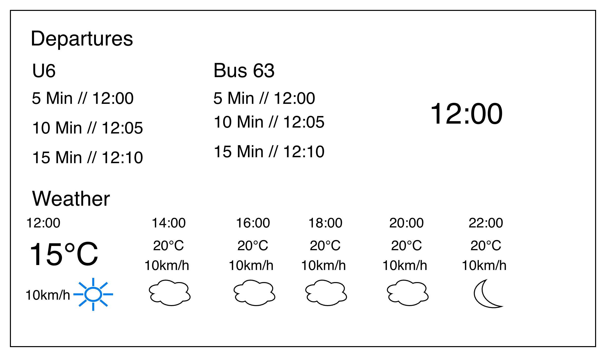

# About

This project is to get some information that I might find useful before going out of home, displayed on an e-Ink. It will display the soonest departure nearby my home. In this case, westpark: U6 and Bus 63. And it should display weather as well.

## Display

The information will be displayed in Inkplate 5Gen2 1280x720 pixels. The Inkplate will poll the backend every 1 minute, and the backend will respond with an image in 1280x720 pixels exactly, containing how it should be rendered in the inkplate.

## Data sources and informations to display

Receiving a request, the backend should then generate an image. Ideally some simple html would do and make a capture out of it (open for discussion), no need for fancy SPA implementation. The e-Ink then will simply display the image

When receiving the request, the backend can retrieve the values from the data sources, and the TTL for the data should be 5 mins, so we're not spamming our data sources.

### Departures

Departure will be from westpark. The following curl is this:

```
curl 'https://www.mvg.de/api/bgw-pt/v3/departures?globalId=de:09162:1340&limit=100&transportTypes=UBAHN,BUS' \
  --compressed \
  -H 'User-Agent: Mozilla/5.0 (Macintosh; Intel Mac OS X 10.15; rv:151.0) Gecko/20100101 Firefox/151.0' \
  -H 'Accept: application/json, text/plain, */*' \
  -H 'Accept-Language: chrome://global/locale/intl.properties' \
  -H 'Accept-Encoding: gzip, deflate, br, zstd' \
  -H 'Content-Type: application/json' \
  -H 'Connection: keep-alive' \
  -H 'Referer: https://www.mvg.de/meinhalt/westpark' \
  -H 'Sec-Fetch-Dest: empty' \
  -H 'Sec-Fetch-Mode: cors' \
  -H 'Sec-Fetch-Site: same-origin' \
  -H 'Priority: u=0' \
  -H 'TE: trailers'
```

It should show the next 3 departures from westpark in 2 columns: left Ubahn U6, right Bus 63.

### Weather

From openweathermap.org , Sendling-Westpark, Bavaria. https://openweathermap.org/city/6556318

API key can be taken from a .env file (have a .env.example), OPEN_WEATHER_API_KEY

We should show a chart showing the temperature, weather, and wind starting from the current viewing time, to the next 12 hour, in a 2h interval.

### Layout

